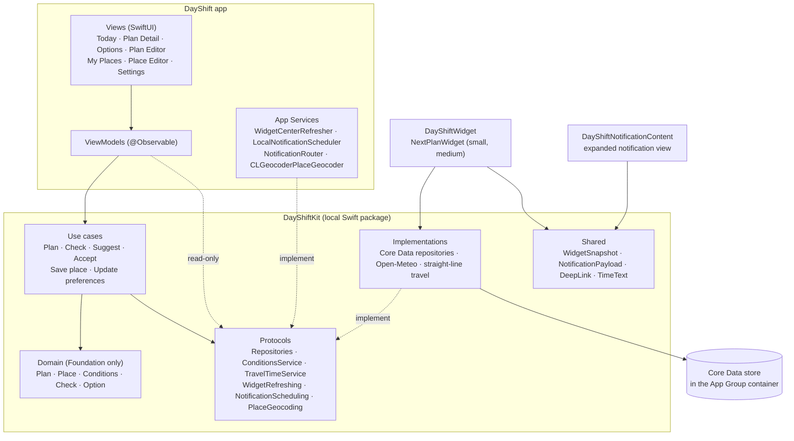

# DayShift

DayShift helps knowledge-work freelancers in Sydney keep their daily plans on track when heat, smoke, UV, wind or rain change during the day.

UTS iOS Software Development, Assessment Task 3. The Required Document (PDF) is submitted separately on Canvas.

## 1. Overview and the problem

Freelancers in Sydney plan their own days: a run in the park, focus work at home or in a library, a client call, a grocery run. On many days the plan stops working: smoke from hazard-reduction burns, a hot afternoon in a flat without air conditioning, high UV at midday, strong wind or rain. People usually notice too late, when the plan is already under way.

DayShift checks each plan against the hourly forecast for its place and time (feels-like temperature, air quality from PM2.5, UV, wind gusts and chance of rain), plus travel time from the previous plan and the place's opening hours. When a plan needs attention, it suggests up to three options, a different time or a different place, that still fit around the rest of the day, using transparent rules rather than an AI model. Lin accepts an option in one tap, and the widget and reminders follow.

## 2. Domain context

**Lin**, 31, is a freelance UI/UX designer in Sydney's inner west. Her flat has no air conditioning. She works from home, a library or a café, meets clients online most days, runs in the park and does a weekly grocery run. The test fixture `LinsThursday` is her day: a smoky morning, a 33°C afternoon and UV 9 around midday.

| Word | Meaning in DayShift |
|---|---|
| **Activity** | A kind of thing Lin does, such as Run or Focus work. Twelve come from a fixed catalogue (`ActivityCatalogue`), each with the conditions it is sensitive to and the kinds of place that suit it. |
| **Plan** | One scheduled activity: a time, a place (or online), and how flexible it is (a time window it can move within, and whether the place can change). |
| **Check** | The result of checking a plan: conditions, travel ("Leave by 6:55 am"), opening hours and crowds, each fine, a tip or a problem. A plan with any problem **needs attention**; otherwise it **looks good**. |
| **Option** | Another time or place for a plan that passes the same checks with no problems, sometimes moving one other flexible plan ("Grocery run moves from 5:30 to 6:30 pm"). |

## 3. Architecture

The app is built in layers. Shared logic lives in a local Swift package, **DayShiftKit**, which the app and both extensions link.



Dependency rules (spec 1.3):
- **Domain** imports Foundation only. Its value types enforce their own rules in throwing initialisers, for example "an online plan can't have a place".
- **Use cases** depend on the Domain and on **protocols** only, take `now` as a parameter, and throw their own `LocalizedError` with what went wrong and what to do next.
- **ViewModels** send every write and business rule through a use case. Read-only data may come from a repository or service protocol, such as the My Places list or the Plan Detail chart. ViewModels never import Core Data.
- **WidgetKit and UserNotifications** are imported only in the app's `Services` folder and in the two extensions.

| Folder | Contents |
|---|---|
| `DayShift/` | The app: `App/` (dependencies, tab bar), `Views/`, `ViewModels/`, `Services/` |
| `DayShiftWidget/` | `NextPlanWidget`, `NextPlanProvider` |
| `DayShiftNotificationContent/` | `NotificationViewController`, `NotificationContentView` |
| `Packages/DayShiftKit/` | `Domain/`, `UseCases/`, `Repositories/`, `Persistence/`, `Conditions/`, `Travel/`, `Services/`, `Shared/`, and the tests |
| `Design/` | The prototype, its interaction spec and `SimulatorPayloads/` (reference only) |

## 4. Extensions and why

**Widget (`NextPlanWidget`, small and medium).** Lin glances at her Home Screen between tasks. The small widget shows the next plan ("Next · 11:00 am · Client call · Online"), its status (icon + words) and either its first problem or "Leave by …". The medium widget adds the two plans after it, one line each. When today has nothing left, it says "That's everything for today." (or "Your day is clear.") and shows up to two plans from the next day with plans, "Coming up · Tomorrow". The timeline has an entry at each plan's start and end, so "In progress" and "Done" change without the app. The app reloads the widget whenever a plan, a check or a preference changes. Tapping opens that plan (`dayshift://plan/<id>`). The widget only reads results the app has saved; it never calls the network and never shows "No data".

**Notification Content Extension (`upcomingPlan`).** Two moments matter most:
- **Leave reminder:** "Leave in 10 min for Focus work". Press and hold to see the trip, the conditions on the way with Lin's limits ("UV 9 · 4 min outside, wear sunscreen" as a tip), the place's opening hours and crowds, and a verdict.
- **Plan affected:** "Your 7:00 am run is affected". Press and hold to see the problem, a Swift Charts chart of that condition by the hour with a dashed line at Lin's limit, and the recommended option.

Everything comes from the payload in the notification, so the extension needs no network or store. "See options" opens the app on the Options screen (`dayshift://options/<id>`), where Lin chooses. The extension only displays, as recorded in the spec's decision log.

## 5. Database

**Core Data**, not CloudKit: DayShift keeps one person's plans on one device, and the widget and notification extension need to read the same store. A local SQLite store in the **App Group** container gives all three targets the same data offline, with no account or sync conflicts. Persistent history tracking is on, and the app reloads when it becomes active.

| Entity | Main attributes | Relationships (delete rule) |
|---|---|---|
| **PlaceEntity** | name, kind, address, suburb, latitude, longitude, indoor, air-conditioned, heat limit, always open, opening hours, closed weekdays | `activities` → ActivityEntity, to-many (**Deny**: a place with plans can't be deleted) |
| **ActivityEntity** (a plan) | type, title, mode, status, start, end (stored for overlap queries), duration, movable window, place change allowed; the latest check (status, summary, checked at, leave by, travel minutes and mode, findings as JSON); notified reasons | `place` → PlaceEntity, to-one (**Nullify**); `adjustments` → AdjustmentRecordEntity, to-many (**Cascade**) |
| **AdjustmentRecordEntity** | kind, previous and new start, previous and new place name, reason, accepted at | `activity` → ActivityEntity, to-one (**Nullify**) |
| **PreferencesEntity** | a single row with Lin's limits and day settings | none |

Enums are stored as their raw strings. Entities never leave the `Persistence` folder: repositories map them to domain values and back, running the same checks as the domain initialisers.

**Domain queries** (`ActivityQuery`, pure functions that return `NSPredicate`, tested without Core Data):
- `plans(on:)`: that day, not cancelled
- `checkablePlans(on:now:)`: that day, starting after now, planned or adjusted ("today's plans that haven't started")
- `plans(overlapping:excluding:)`: overlapping a time, leaving out given plans, not cancelled
- `plansNeedingAttention(on:)`: that day, check status "needs attention", not cancelled

## 6. App Group

**`group.com.utsstudent.zhaoziying.dayshift`**

It is used by the app, the widget and the notification extension (each target's `.entitlements`), and in code by `AppGroup.identifier` (`Packages/DayShiftKit/Sources/DayShiftKit/Shared/AppGroup.swift`).

## 7. Setup

- **Xcode 26** (built with Xcode 26.4.1); the app targets **iOS 17.0** or later.
- Open `DayShift.xcodeproj`, choose the **DayShift** scheme and an iPhone Simulator, then Run. No third-party packages are needed; DayShiftKit is a local package and resolves automatically.
- **Tests:** run the `DayShiftKit` scheme's tests in Xcode (Product → Test), or from the terminal:
  ```
  cd Packages/DayShiftKit
  swift test
  ```
- **Building with your own team:** select your team on all three targets (DayShift, DayShiftWidgetExtension, DayShiftNotificationContent). Then change the App Group ID, to the same new value, in all three targets' App Groups capability **and** in `AppGroup.identifier`. If the IDs don't match, the app shows "DayShift can't open its shared storage." instead of crashing.

## 8. How to see every feature

Use the Simulator, with an internet connection for the forecast and address lookups.

1. **Add your places (My Places tab).** Tap **Add a place** and add, for example:
   - **Home**: kind Home, address "Enmore Rd, Enmore NSW 2042". Leave Air-conditioned off and the limit at 30°C ("It gets too hot here when it's above 30°C outside").
   - **Newtown Library**: kind Library, address "8 Brown St, Newtown NSW 2042". The hours are pre-filled as "Typical for libraries: 10 am to 8 pm"; check and edit them.
   - **Enmore Park**: kind Park, address "Enmore Park, Marrickville NSW 2204".
   - **Marrickville Metro**: kind Shopping centre, address "34 Victoria Rd, Marrickville NSW 2204".

   DayShift looks each address up when you save. Saving a second place called "Home" shows an inline error.
2. **If you are testing after 9 pm:** in **Settings → Your day**, change **Plan until** to a later time (for example 11:30 pm) and tap **Save changes**. Plans outside planning hours are rejected ("This plan is outside your planning hours …").
3. **Plan activities (Today → +).** Plan a run at Enmore Park later today that **can move** (turn on Can move and widen the times), and Focus work at Home in the afternoon that **can change place**. The first time you save a plan, DayShift explains alerts and then iOS asks; choose **Allow**. Try an online Client meeting that overlaps another plan to see the inline error, with **Save plan** disabled.
4. **Read a plan (tap it on Today).** Plan Detail shows Conditions, Travel, Opening hours and Crowds. When a condition at the place is a problem, a chart shows it by the hour with a dashed line at your limit.
5. **Make a plan need attention on a mild day.** In **Settings → Your limits**, lower a limit (for example **Max UV 3** or **Max feels-like 20°C**) and tap **Save changes**. Today and the widget update, and outdoor plans show **Needs attention**.
6. **Use an option.** On a flexible plan, tap **See better options** (or **Find other options** when it looks good), then **Use this plan**. You return to Today with "Your run is now at …", the plan is tagged **Moved**, and the widget updates. If no time or place works, the screen says why ("Wind gusts 56–70 km/h all day, above your limit of 40 km/h.").
7. **Add both widget sizes.** On the Home Screen, touch and hold, tap **Edit → Add Widget**, find **DayShift → Next plan**, and add the **small** and the **medium** size. Tap a widget or a row to open that plan. Plan something for tomorrow to see "Coming up · Tomorrow" once today is done.
8. **Leave reminder.** Plan an in-person activity starting in about **30 minutes** at a place in **another suburb** than Home, for example Newtown Library. The reminder arrives 10 minutes before you need to leave ("Leave in 10 min for …"); it shows as a banner even while the app is open. Lock the Simulator, then press and hold the notification for the expanded view, and tap **Got it**.
9. **Plan-affected alert (sample file).** `Design/SimulatorPayloads/plan-affected-run.apns` is a sample "Your 7:00 am run is affected" alert, with the air-quality chart and the recommended option, as in the prototype's AffectedExpanded screen. It is kept outside the app bundle.
   1. Run DayShift on the Simulator once and allow alerts.
   2. Go to the Home Screen (or lock the Simulator), so the alert isn't shown inside the app.
   3. Drag `plan-affected-run.apns` onto the Simulator window, or run
      `xcrun simctl push booted com.utsstudent.zhaoziying.DayShift Design/SimulatorPayloads/plan-affected-run.apns`.
   4. Press and hold the notification to see the expanded view.

   The sample's plan isn't saved in the app, so "See options" and tapping the alert open Today with "This plan no longer exists." Real alerts, which DayShift sends when a check finds a new problem at least 15 minutes before a plan, open the plan.

## 9. Tests

**59 tests in 19 suites**, written with Swift Testing in `Packages/DayShiftKit/Tests`. They use the `LinsThursday` fixture, saved Open-Meteo sample responses and mocks for every protocol. They never touch the network or the Core Data stack, and `now` is always fixed.

| Area | Suites (tests) | What they cover |
|---|---|---|
| Domain | Place (2), PlannedActivity (3), PlanFinding (3), DaySchedule (3), ActivityType (1), AirQualityCategory (1) | The domain rules: an outdoor place can't be air-conditioned, an online plan has no place, window rules, the 10-minute tip boundary, the gap rule (exactly 15 minutes is enough), Around home, PM2.5 category boundaries |
| Use cases | PlanActivity (4), CheckUpcomingPlans (8), SuggestAlternatives (8), AcceptAlternative (4), SavePlace (2), UpdateComfortPreferences (2) | Saving and rejecting plans; smoke, heat and UV findings; missing conditions; online plans; one alert per reason, and none early for a later day; the 5:30 pm option with the grocery run moving; fixed plans never moving; no viable option and why; accepting saves both plans and two records together, and nothing changes if saving fails; duplicate names and unknown addresses; preference ranges |
| Query | ActivityQuery (2) | Checkable plans, and cancelled plans never needing attention |
| Data | OpenMeteoDecoding (2), StraightLineTravelTime (3) | Decoding and joining weather and air quality by hour; travel estimates, including walking short trips |
| Widget and shared | WidgetSnapshot (7), DeepLink (1), NotificationPayload (2), LinsThursday (1) | What the widget shows next, empty and all-done states, coming-up plans, the timeline; deep links; notification payloads |

All 14 required tests in spec 8.3 are included. The one listed extra that isn't covered is the forecast being unavailable during a check.

## 10. Attributions

- **Weather and air quality data:** [Open-Meteo](https://open-meteo.com/), free for non-commercial use, data licensed under [CC BY 4.0](https://creativecommons.org/licenses/by/4.0/). Air quality comes from Open-Meteo's Air Quality API, which is based on the Copernicus Atmosphere Monitoring Service (CAMS).
- **Air quality categories:** NSW Government, [Air quality categories](https://www.environment.nsw.gov.au/topics/air/exploring-air-quality-data/air-quality-categories). DayShift uses the 1-hour PM2.5 categories Good below 25, Fair 25–50, Poor above 50 to 100, Very poor above 100 to 300, and Extremely poor above 300 µg/m³.
- **Apple documentation:** SwiftUI, WidgetKit, UserNotifications and UserNotificationsUI, Core Data, Swift Charts, Core Location (`CLGeocoder`) and App Groups.

## 11. Known limitations

- **Travel times are estimates** from straight-line distance (× 1.3 for roads, typical speeds per mode, 10 minutes' wait for public transport, and walking for trips of 15 minutes or less). There is no routing or live transport data.
- **Outdoor temperature stands in for indoor heat.** DayShift can't measure Lin's room; it uses the outside temperature against the limit she sets for each place without AC.
- **Crowd levels are estimates** from simple rules per kind of place, not live data.
- **Checks run when the app is opened** (and after changes). There is no background refresh, so statuses and alerts can be out of date if the app isn't opened. Plans on later days are checked on their day.
- **PM2.5 categories:** DayShift uses the earlier NSW 1-hour PM2.5 categories. The 2025 enHealth guidance, now used by Queensland, has stricter 1-hour values (12.5 / 25 / 50 / 150 µg/m³), which this build doesn't adopt.
- **Not built** (spec 0.5 and 7.3): calendar import, map routing and place search (an address field replaces it), accounts and sync, History, Undo, switching to another activity or to online as an option, the Lock Screen widget, and accepting an option inside the notification (it opens the app instead).
- **Places can't be deleted** in this build, and a place with plans is protected by the Deny rule.
- **Notifications need permission and the app to have run once**, and the expanded view needs a press and hold. The sample `.apns` file's plan isn't saved, so tapping it opens Today.

## 12. AI assistance

I used Claude for research, planning, writing the development spec and finding bugs. I used Claude to give advices on building the code structure, logic and unit tests for each step of the spec. I reviewed every change against the spec and the prototype, asked for changes or rejected suggestions that did not fit, and only committed after the tests passed and the app worked on the Simulator. The same is declared in the project report.
